# Golang Testing with TDD

Este repositório contém os códigos e a documentação relacionados à tarefa baseada no tutorial [Golang Testing with TDD](https://williaminfante.medium.com/golang-testing-with-tdd-e548d8be776).

## Objetivos da Tarefa

1. **Criar o repositório no Github** - [2.0 pontos]
   - Este repositório foi criado para armazenar os códigos e documentações relacionados ao tutorial.

2. **Executar cada exemplo e documentar por prints as execuções** - [4.0 pontos]
   - Abaixo estão os prints das execuções de cada exemplo do tutorial, junto com uma breve descrição do que foi testado em cada caso.

## Prints das Execuções

### 1. Importando o Pacote `github.com/stretchr/testify/assert`
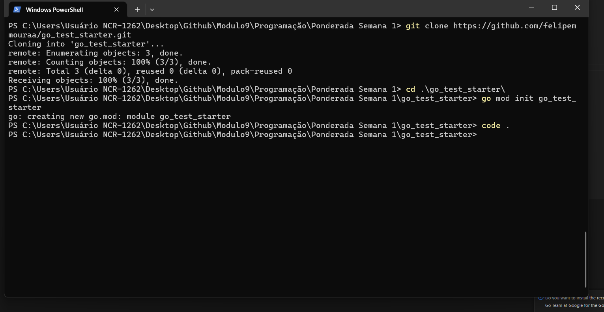
- **Descrição**: Importação do pacote de assertions `github.com/stretchr/testify/assert` para facilitar a escrita de testes.

### 2. Primeiro Teste com Erro e Segundo Teste com Sucesso
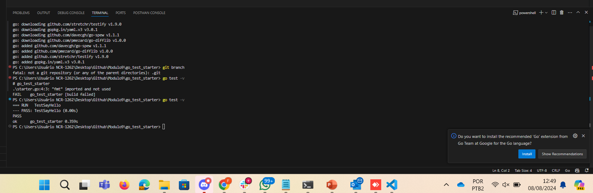
- **Descrição**: Inicialmente, o teste falha conforme esperado; em seguida, a implementação é corrigida para que o teste passe.

### 3. Testando Novamente com Alteração na Função `TestSayHello`
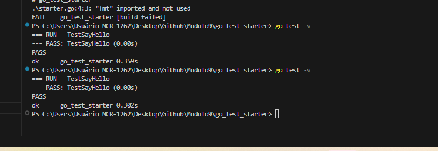
- **Descrição**: Alteração da função de teste para validar novos comportamentos ou cenários, e sua execução.

### 4. Executando Primeiro Teste da Função `TestOddOrEven`
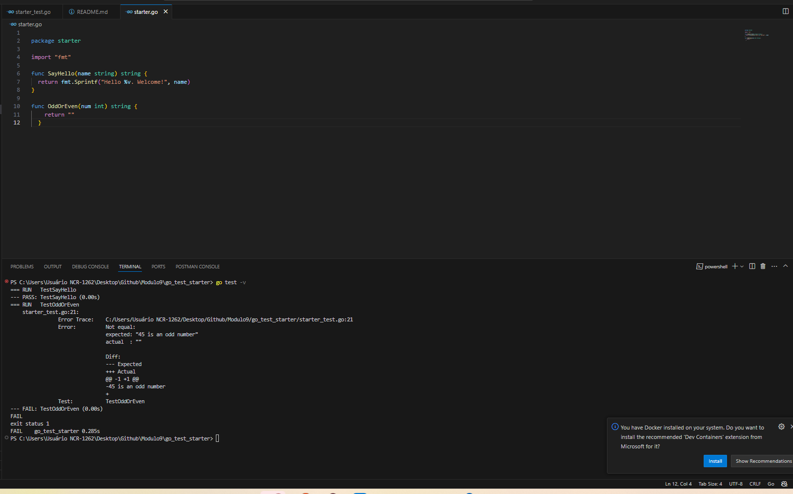
- **Descrição**: Teste inicial da função `OddOrEven` para verificar se retorna "Odd" ou "Even" corretamente.

### 5. Usando a Execução Rápida com o Comando `go test`
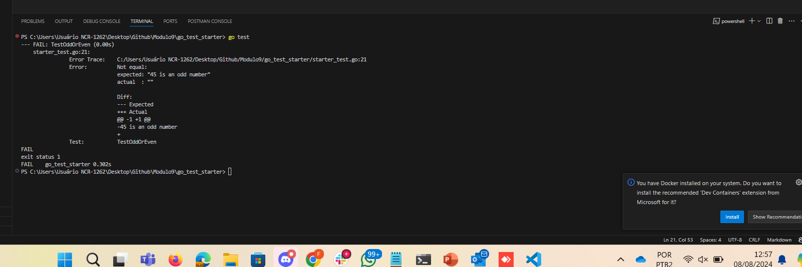
- **Descrição**: Demonstração de como utilizar o comando `go test` para executar rapidamente todos os testes.

### 6. Mudando a Função `OddOrEven` para Passar no Teste
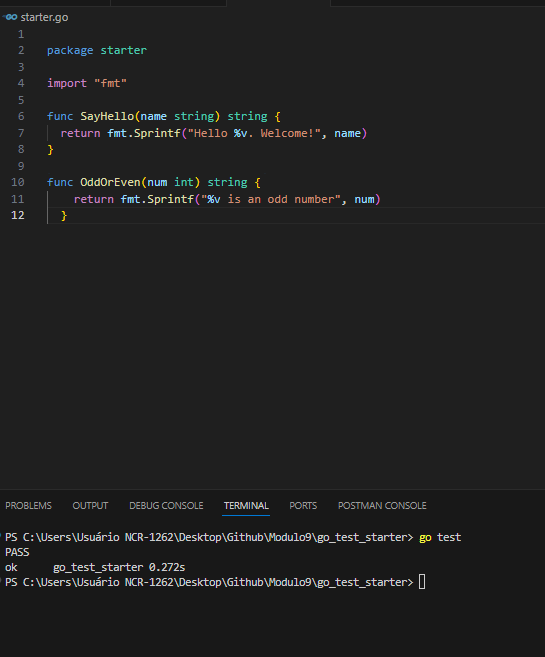
- **Descrição**: Implementação de ajustes na função `OddOrEven` para garantir que o teste passe.

### 7. Mudando a Função `TestOddOrEven` e Obtendo Erro
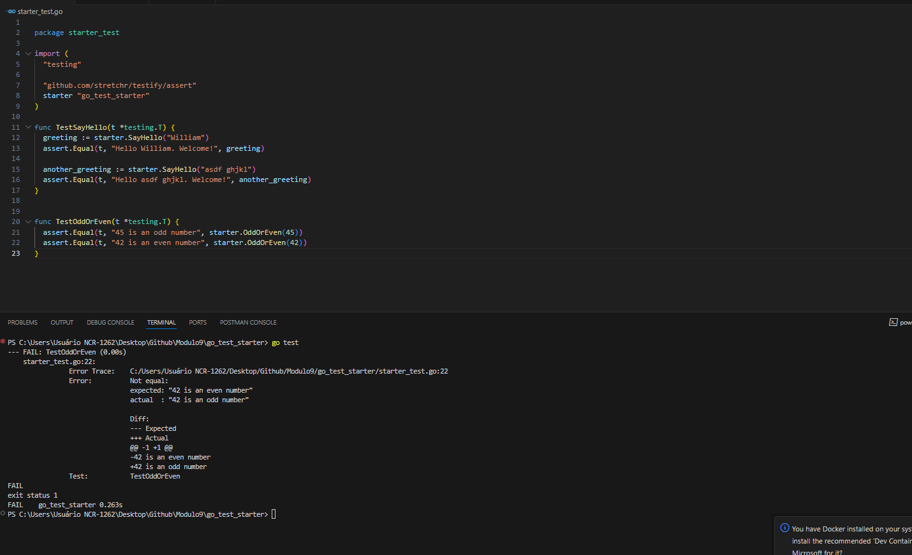
- **Descrição**: Ajuste no teste que resulta em uma falha, destacando a importância do TDD em capturar erros.

### 8. Mais um Teste
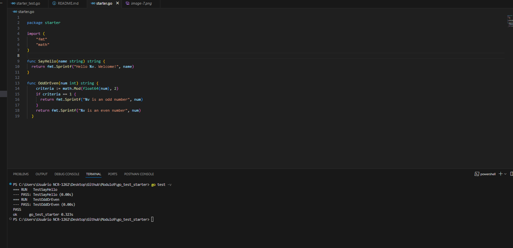
- **Descrição**: Adição de mais um caso de teste para aumentar a cobertura e robustez dos testes.

### 9. Testando o Teste com -45
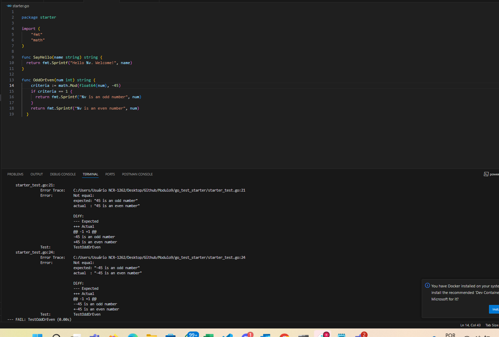
- **Descrição**: Execução de um teste específico para um número negativo (-45) na função `OddOrEven`.

### 10. Testando Subtestes
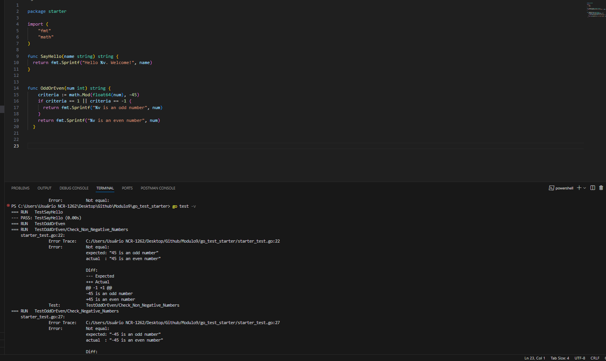
- **Descrição**: Implementação e execução de subtestes para validar diferentes cenários dentro de um mesmo teste.

### 11. Sumarizando os Testes
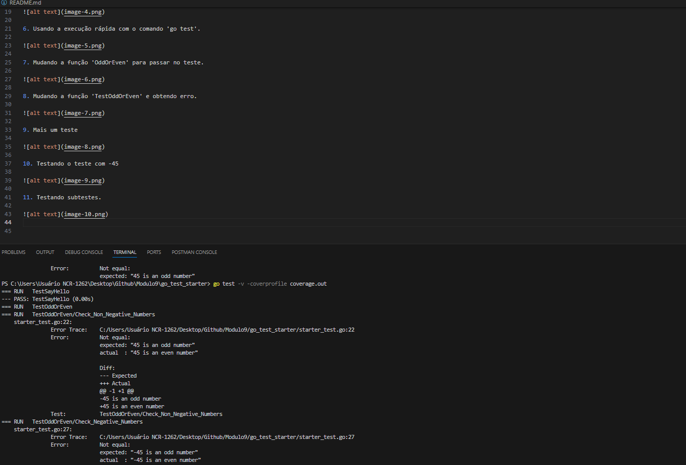
- **Descrição**: Sumário dos resultados de todos os testes, demonstrando a conclusão e sucesso dos casos testados.

## Comentários Ampliados sobre TDD

### O que é TDD?
Test-Driven Development (TDD) é uma prática de desenvolvimento de software onde os testes são escritos antes do código de produção. O ciclo básico de TDD é:
1. **Escrever um teste** para uma nova funcionalidade.
2. **Executar o teste** e observar que ele falha (já que a funcionalidade ainda não foi implementada).
3. **Escrever o código mínimo necessário** para fazer o teste passar.
4. **Refatorar o código**, melhorando sua estrutura sem alterar seu comportamento.
5. **Repetir** o processo para cada nova funcionalidade.

TDD segue o ciclo Red-Green-Refactor: 1) Escreva um teste que inicialmente falha (Red), 2) Implemente o código mínimo para passar o teste (Green), 3) Refatore o código mantendo os testes verdes. 

TDD promove pequenos testes incrementais, design orientado por testes, feedback contínuo, maior cobertura de código, simplicidade, e confiança na evolução do código, garantindo software mais confiável e fácil de manter.
