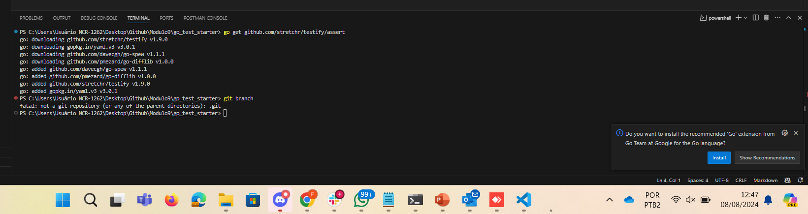

1. Criando repositório e iniciando módulo go.

2. Importando o Pacote github.com/stretchr/testify/assert

3. Primeiro teste com erro e segundo teste com sucesso.

4. Testando novamente com alteração na função 'TestSayHello'.

5. Executando primeiro teste da função 'TestOddOrEven'.

6. Usando a execução rápida com o comando 'go test'.

7. Mudando a função 'OddOrEven' para passar no teste.

8. Mudando a função 'TestOddOrEven' e obtendo erro.

9. Mais um teste

10. Testando o teste com -45

11. Testando subtestes.

12. Sumarizando os testes.

13. 